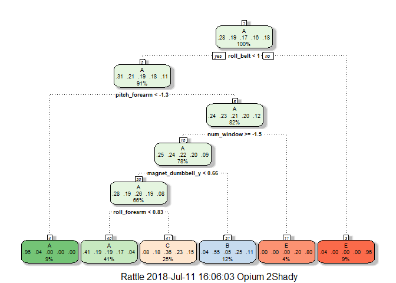

##Setup & Loading Required Packages


```r
setwd("C:/Users/acer/Desktop/R Stuff")
library(caret)
```

```
## Warning: package 'caret' was built under R version 3.5.1
```

```
## Loading required package: lattice
```

```
## Loading required package: ggplot2
```

```r
library(rattle)
```

```
## Warning: package 'rattle' was built under R version 3.5.1
```

```
## Rattle: A free graphical interface for data science with R.
## Version 5.1.0 Copyright (c) 2006-2017 Togaware Pty Ltd.
## Type 'rattle()' to shake, rattle, and roll your data.
```

```r
library(corrplot)
```

```
## Warning: package 'corrplot' was built under R version 3.5.1
```

```
## corrplot 0.84 loaded
```

##Summary

Using devices such as Jawbone Up, Nike FuelBand, and Fitbit it is now possible to collect a large amount of data about personal activity relatively inexpensively. These type of devices are part of the quantified self movement - a group of enthusiasts who take measurements about themselves regularly to improve their health, to find patterns in their behavior, or because they are tech geeks. One thing that people regularly do is quantify how much of a particular activity they do, but they rarely quantify how well they do it. In this project, my goal will be to use data from accelerometers on the belt, forearm, arm, and dumbell of 6 participants. They were asked to perform barbell lifts correctly and incorrectly in 5 different ways.

##Synopsis

The goal of this project is to predict the manner in which they did the exercise. This is the "classe" variable in the training set. I can use any of the other variables to predict with, use cross validation,find the expected out of sample error and use my prediction model to predict 20 different test cases.

###Exploratory Analysis

Downloading and loading data in R.

```r
download.file("https://d396qusza40orc.cloudfront.net/predmachlearn/pml-training.csv","training.csv")
download.file("https://d396qusza40orc.cloudfront.net/predmachlearn/pml-testing.csv","testing.csv")
training<-read.csv("training.csv")
testing<-read.csv("testing.csv")
dim(training)
```

```
## [1] 19622   160
```
We see our data has 160 variables including the outcome variable classe and a total of 19622 observations.


```r
str(training$classe)
```

```
##  Factor w/ 5 levels "A","B","C","D",..: 1 1 1 1 1 1 1 1 1 1 ...
```
So we see there are 5 different Classes namely A,B,C,D, and E.

##Cleaning Data

First we partition our data into 2 sets ,one for training our model and the other for cross validating it.


```r
set.seed(999)
inTrain<-createDataPartition(training$classe,p=0.60,list=FALSE)
train<-training[inTrain,]
test<-training[-inTrain,]
```

Since our data is still huge,we start by removing Near Zero Variables from both train and test.


```r
ZeroVar<-nearZeroVar(train,saveMetrics = TRUE)
train<-train[,ZeroVar$nzv==FALSE]
test<-test[,ZeroVar$nzv==FALSE]
str(train)
```

```
## 'data.frame':	11776 obs. of  106 variables:
##  $ X                       : int  1 3 4 5 9 13 14 15 16 17 ...
##  $ user_name               : Factor w/ 6 levels "adelmo","carlitos",..: 2 2 2 2 2 2 2 2 2 2 ...
##  $ raw_timestamp_part_1    : int  1323084231 1323084231 1323084232 1323084232 1323084232 1323084232 1323084232 1323084232 1323084232 1323084232 ...
##  $ raw_timestamp_part_2    : int  788290 820366 120339 196328 484323 560359 576390 604281 644302 692324 ...
##  $ cvtd_timestamp          : Factor w/ 20 levels "02/12/2011 13:32",..: 9 9 9 9 9 9 9 9 9 9 ...
##  $ num_window              : int  11 11 12 12 12 12 12 12 12 12 ...
##  $ roll_belt               : num  1.41 1.42 1.48 1.48 1.43 1.42 1.42 1.45 1.48 1.51 ...
##  $ pitch_belt              : num  8.07 8.07 8.05 8.07 8.16 8.2 8.21 8.2 8.15 8.12 ...
##  $ yaw_belt                : num  -94.4 -94.4 -94.4 -94.4 -94.4 -94.4 -94.4 -94.4 -94.4 -94.4 ...
##  $ total_accel_belt        : int  3 3 3 3 3 3 3 3 3 3 ...
##  $ max_roll_belt           : num  NA NA NA NA NA NA NA NA NA NA ...
##  $ max_picth_belt          : int  NA NA NA NA NA NA NA NA NA NA ...
##  $ min_roll_belt           : num  NA NA NA NA NA NA NA NA NA NA ...
##  $ min_pitch_belt          : int  NA NA NA NA NA NA NA NA NA NA ...
##  $ amplitude_roll_belt     : num  NA NA NA NA NA NA NA NA NA NA ...
##  $ amplitude_pitch_belt    : int  NA NA NA NA NA NA NA NA NA NA ...
##  $ var_total_accel_belt    : num  NA NA NA NA NA NA NA NA NA NA ...
##  $ avg_roll_belt           : num  NA NA NA NA NA NA NA NA NA NA ...
##  $ stddev_roll_belt        : num  NA NA NA NA NA NA NA NA NA NA ...
##  $ var_roll_belt           : num  NA NA NA NA NA NA NA NA NA NA ...
##  $ avg_pitch_belt          : num  NA NA NA NA NA NA NA NA NA NA ...
##  $ stddev_pitch_belt       : num  NA NA NA NA NA NA NA NA NA NA ...
##  $ var_pitch_belt          : num  NA NA NA NA NA NA NA NA NA NA ...
##  $ avg_yaw_belt            : num  NA NA NA NA NA NA NA NA NA NA ...
##  $ stddev_yaw_belt         : num  NA NA NA NA NA NA NA NA NA NA ...
##  $ var_yaw_belt            : num  NA NA NA NA NA NA NA NA NA NA ...
##  $ gyros_belt_x            : num  0 0 0.02 0.02 0.02 0.02 0.02 0 0 0 ...
##  $ gyros_belt_y            : num  0 0 0 0.02 0 0 0 0 0 0 ...
##  $ gyros_belt_z            : num  -0.02 -0.02 -0.03 -0.02 -0.02 0 -0.02 0 0 -0.02 ...
##  $ accel_belt_x            : int  -21 -20 -22 -21 -20 -22 -22 -21 -21 -21 ...
##  $ accel_belt_y            : int  4 5 3 2 2 4 4 2 4 4 ...
##  $ accel_belt_z            : int  22 23 21 24 24 21 21 22 23 22 ...
##  $ magnet_belt_x           : int  -3 -2 -6 -6 1 -3 -8 -1 0 -6 ...
##  $ magnet_belt_y           : int  599 600 604 600 602 606 598 597 592 598 ...
##  $ magnet_belt_z           : int  -313 -305 -310 -302 -312 -309 -310 -310 -305 -317 ...
##  $ roll_arm                : num  -128 -128 -128 -128 -128 -128 -128 -129 -129 -129 ...
##  $ pitch_arm               : num  22.5 22.5 22.1 22.1 21.7 21.4 21.4 21.4 21.3 21.3 ...
##  $ yaw_arm                 : num  -161 -161 -161 -161 -161 -161 -161 -161 -161 -161 ...
##  $ total_accel_arm         : int  34 34 34 34 34 34 34 34 34 34 ...
##  $ var_accel_arm           : num  NA NA NA NA NA NA NA NA NA NA ...
##  $ gyros_arm_x             : num  0 0.02 0.02 0 0.02 0.02 0.02 0.02 0.02 0.02 ...
##  $ gyros_arm_y             : num  0 -0.02 -0.03 -0.03 -0.03 -0.02 0 0 0 0 ...
##  $ gyros_arm_z             : num  -0.02 -0.02 0.02 0 -0.02 -0.02 -0.03 -0.03 -0.03 -0.02 ...
##  $ accel_arm_x             : int  -288 -289 -289 -289 -288 -287 -288 -289 -289 -289 ...
##  $ accel_arm_y             : int  109 110 111 111 109 111 111 111 109 110 ...
##  $ accel_arm_z             : int  -123 -126 -123 -123 -122 -124 -124 -124 -121 -122 ...
##  $ magnet_arm_x            : int  -368 -368 -372 -374 -369 -372 -371 -374 -367 -371 ...
##  $ magnet_arm_y            : int  337 344 344 337 341 338 331 342 340 337 ...
##  $ magnet_arm_z            : int  516 513 512 506 518 509 523 510 509 512 ...
##  $ max_roll_arm            : num  NA NA NA NA NA NA NA NA NA NA ...
##  $ max_picth_arm           : num  NA NA NA NA NA NA NA NA NA NA ...
##  $ max_yaw_arm             : int  NA NA NA NA NA NA NA NA NA NA ...
##  $ min_roll_arm            : num  NA NA NA NA NA NA NA NA NA NA ...
##  $ min_pitch_arm           : num  NA NA NA NA NA NA NA NA NA NA ...
##  $ min_yaw_arm             : int  NA NA NA NA NA NA NA NA NA NA ...
##  $ amplitude_pitch_arm     : num  NA NA NA NA NA NA NA NA NA NA ...
##  $ amplitude_yaw_arm       : int  NA NA NA NA NA NA NA NA NA NA ...
##  $ roll_dumbbell           : num  13.1 12.9 13.4 13.4 13.2 ...
##  $ pitch_dumbbell          : num  -70.5 -70.3 -70.4 -70.4 -70.4 ...
##  $ yaw_dumbbell            : num  -84.9 -85.1 -84.9 -84.9 -84.9 ...
##  $ max_roll_dumbbell       : num  NA NA NA NA NA NA NA NA NA NA ...
##  $ max_picth_dumbbell      : num  NA NA NA NA NA NA NA NA NA NA ...
##  $ min_roll_dumbbell       : num  NA NA NA NA NA NA NA NA NA NA ...
##  $ min_pitch_dumbbell      : num  NA NA NA NA NA NA NA NA NA NA ...
##  $ amplitude_roll_dumbbell : num  NA NA NA NA NA NA NA NA NA NA ...
##  $ amplitude_pitch_dumbbell: num  NA NA NA NA NA NA NA NA NA NA ...
##  $ total_accel_dumbbell    : int  37 37 37 37 37 37 37 37 37 37 ...
##  $ var_accel_dumbbell      : num  NA NA NA NA NA NA NA NA NA NA ...
##  $ avg_roll_dumbbell       : num  NA NA NA NA NA NA NA NA NA NA ...
##  $ stddev_roll_dumbbell    : num  NA NA NA NA NA NA NA NA NA NA ...
##  $ var_roll_dumbbell       : num  NA NA NA NA NA NA NA NA NA NA ...
##  $ avg_pitch_dumbbell      : num  NA NA NA NA NA NA NA NA NA NA ...
##  $ stddev_pitch_dumbbell   : num  NA NA NA NA NA NA NA NA NA NA ...
##  $ var_pitch_dumbbell      : num  NA NA NA NA NA NA NA NA NA NA ...
##  $ avg_yaw_dumbbell        : num  NA NA NA NA NA NA NA NA NA NA ...
##  $ stddev_yaw_dumbbell     : num  NA NA NA NA NA NA NA NA NA NA ...
##  $ var_yaw_dumbbell        : num  NA NA NA NA NA NA NA NA NA NA ...
##  $ gyros_dumbbell_x        : num  0 0 0 0 0 0 0.02 0 0 0 ...
##  $ gyros_dumbbell_y        : num  -0.02 -0.02 -0.02 -0.02 -0.02 -0.02 -0.02 -0.02 -0.02 -0.02 ...
##  $ gyros_dumbbell_z        : num  0 0 -0.02 0 0 -0.02 -0.02 0 0 0 ...
##  $ accel_dumbbell_x        : int  -234 -232 -232 -233 -232 -234 -234 -234 -233 -233 ...
##  $ accel_dumbbell_y        : int  47 46 48 48 47 48 48 47 48 47 ...
##  $ accel_dumbbell_z        : int  -271 -270 -269 -270 -269 -269 -268 -270 -271 -272 ...
##  $ magnet_dumbbell_x       : int  -559 -561 -552 -554 -549 -552 -554 -554 -554 -551 ...
##  $ magnet_dumbbell_y       : int  293 298 303 292 292 302 295 294 297 296 ...
##  $ magnet_dumbbell_z       : num  -65 -63 -60 -68 -65 -69 -68 -63 -73 -56 ...
##  $ roll_forearm            : num  28.4 28.3 28.1 28 27.7 27.2 27.2 27.2 27.1 27.1 ...
##  $ pitch_forearm           : num  -63.9 -63.9 -63.9 -63.9 -63.8 -63.9 -63.9 -63.9 -64 -64 ...
##  $ yaw_forearm             : num  -153 -152 -152 -152 -152 -151 -151 -151 -151 -151 ...
##  $ max_picth_forearm       : num  NA NA NA NA NA NA NA NA NA NA ...
##  $ min_roll_forearm        : num  NA NA NA NA NA NA NA NA NA NA ...
##  $ min_pitch_forearm       : num  NA NA NA NA NA NA NA NA NA NA ...
##  $ amplitude_roll_forearm  : num  NA NA NA NA NA NA NA NA NA NA ...
##  $ amplitude_pitch_forearm : num  NA NA NA NA NA NA NA NA NA NA ...
##  $ total_accel_forearm     : int  36 36 36 36 36 36 36 36 36 36 ...
##  $ var_accel_forearm       : num  NA NA NA NA NA NA NA NA NA NA ...
##  $ gyros_forearm_x         : num  0.03 0.03 0.02 0.02 0.03 0 0 0 0.02 0.02 ...
##  $ gyros_forearm_y         : num  0 -0.02 -0.02 0 0 0 -0.02 -0.02 0 -0.02 ...
##  $ gyros_forearm_z         : num  -0.02 0 0 -0.02 -0.02 -0.03 -0.03 -0.02 0 0 ...
##   [list output truncated]
```

Next,we remove indicator variables.


```r
train<-train[,-(1:5)]
test<-test[,-(1:5)]
str(train)
```

```
## 'data.frame':	11776 obs. of  101 variables:
##  $ num_window              : int  11 11 12 12 12 12 12 12 12 12 ...
##  $ roll_belt               : num  1.41 1.42 1.48 1.48 1.43 1.42 1.42 1.45 1.48 1.51 ...
##  $ pitch_belt              : num  8.07 8.07 8.05 8.07 8.16 8.2 8.21 8.2 8.15 8.12 ...
##  $ yaw_belt                : num  -94.4 -94.4 -94.4 -94.4 -94.4 -94.4 -94.4 -94.4 -94.4 -94.4 ...
##  $ total_accel_belt        : int  3 3 3 3 3 3 3 3 3 3 ...
##  $ max_roll_belt           : num  NA NA NA NA NA NA NA NA NA NA ...
##  $ max_picth_belt          : int  NA NA NA NA NA NA NA NA NA NA ...
##  $ min_roll_belt           : num  NA NA NA NA NA NA NA NA NA NA ...
##  $ min_pitch_belt          : int  NA NA NA NA NA NA NA NA NA NA ...
##  $ amplitude_roll_belt     : num  NA NA NA NA NA NA NA NA NA NA ...
##  $ amplitude_pitch_belt    : int  NA NA NA NA NA NA NA NA NA NA ...
##  $ var_total_accel_belt    : num  NA NA NA NA NA NA NA NA NA NA ...
##  $ avg_roll_belt           : num  NA NA NA NA NA NA NA NA NA NA ...
##  $ stddev_roll_belt        : num  NA NA NA NA NA NA NA NA NA NA ...
##  $ var_roll_belt           : num  NA NA NA NA NA NA NA NA NA NA ...
##  $ avg_pitch_belt          : num  NA NA NA NA NA NA NA NA NA NA ...
##  $ stddev_pitch_belt       : num  NA NA NA NA NA NA NA NA NA NA ...
##  $ var_pitch_belt          : num  NA NA NA NA NA NA NA NA NA NA ...
##  $ avg_yaw_belt            : num  NA NA NA NA NA NA NA NA NA NA ...
##  $ stddev_yaw_belt         : num  NA NA NA NA NA NA NA NA NA NA ...
##  $ var_yaw_belt            : num  NA NA NA NA NA NA NA NA NA NA ...
##  $ gyros_belt_x            : num  0 0 0.02 0.02 0.02 0.02 0.02 0 0 0 ...
##  $ gyros_belt_y            : num  0 0 0 0.02 0 0 0 0 0 0 ...
##  $ gyros_belt_z            : num  -0.02 -0.02 -0.03 -0.02 -0.02 0 -0.02 0 0 -0.02 ...
##  $ accel_belt_x            : int  -21 -20 -22 -21 -20 -22 -22 -21 -21 -21 ...
##  $ accel_belt_y            : int  4 5 3 2 2 4 4 2 4 4 ...
##  $ accel_belt_z            : int  22 23 21 24 24 21 21 22 23 22 ...
##  $ magnet_belt_x           : int  -3 -2 -6 -6 1 -3 -8 -1 0 -6 ...
##  $ magnet_belt_y           : int  599 600 604 600 602 606 598 597 592 598 ...
##  $ magnet_belt_z           : int  -313 -305 -310 -302 -312 -309 -310 -310 -305 -317 ...
##  $ roll_arm                : num  -128 -128 -128 -128 -128 -128 -128 -129 -129 -129 ...
##  $ pitch_arm               : num  22.5 22.5 22.1 22.1 21.7 21.4 21.4 21.4 21.3 21.3 ...
##  $ yaw_arm                 : num  -161 -161 -161 -161 -161 -161 -161 -161 -161 -161 ...
##  $ total_accel_arm         : int  34 34 34 34 34 34 34 34 34 34 ...
##  $ var_accel_arm           : num  NA NA NA NA NA NA NA NA NA NA ...
##  $ gyros_arm_x             : num  0 0.02 0.02 0 0.02 0.02 0.02 0.02 0.02 0.02 ...
##  $ gyros_arm_y             : num  0 -0.02 -0.03 -0.03 -0.03 -0.02 0 0 0 0 ...
##  $ gyros_arm_z             : num  -0.02 -0.02 0.02 0 -0.02 -0.02 -0.03 -0.03 -0.03 -0.02 ...
##  $ accel_arm_x             : int  -288 -289 -289 -289 -288 -287 -288 -289 -289 -289 ...
##  $ accel_arm_y             : int  109 110 111 111 109 111 111 111 109 110 ...
##  $ accel_arm_z             : int  -123 -126 -123 -123 -122 -124 -124 -124 -121 -122 ...
##  $ magnet_arm_x            : int  -368 -368 -372 -374 -369 -372 -371 -374 -367 -371 ...
##  $ magnet_arm_y            : int  337 344 344 337 341 338 331 342 340 337 ...
##  $ magnet_arm_z            : int  516 513 512 506 518 509 523 510 509 512 ...
##  $ max_roll_arm            : num  NA NA NA NA NA NA NA NA NA NA ...
##  $ max_picth_arm           : num  NA NA NA NA NA NA NA NA NA NA ...
##  $ max_yaw_arm             : int  NA NA NA NA NA NA NA NA NA NA ...
##  $ min_roll_arm            : num  NA NA NA NA NA NA NA NA NA NA ...
##  $ min_pitch_arm           : num  NA NA NA NA NA NA NA NA NA NA ...
##  $ min_yaw_arm             : int  NA NA NA NA NA NA NA NA NA NA ...
##  $ amplitude_pitch_arm     : num  NA NA NA NA NA NA NA NA NA NA ...
##  $ amplitude_yaw_arm       : int  NA NA NA NA NA NA NA NA NA NA ...
##  $ roll_dumbbell           : num  13.1 12.9 13.4 13.4 13.2 ...
##  $ pitch_dumbbell          : num  -70.5 -70.3 -70.4 -70.4 -70.4 ...
##  $ yaw_dumbbell            : num  -84.9 -85.1 -84.9 -84.9 -84.9 ...
##  $ max_roll_dumbbell       : num  NA NA NA NA NA NA NA NA NA NA ...
##  $ max_picth_dumbbell      : num  NA NA NA NA NA NA NA NA NA NA ...
##  $ min_roll_dumbbell       : num  NA NA NA NA NA NA NA NA NA NA ...
##  $ min_pitch_dumbbell      : num  NA NA NA NA NA NA NA NA NA NA ...
##  $ amplitude_roll_dumbbell : num  NA NA NA NA NA NA NA NA NA NA ...
##  $ amplitude_pitch_dumbbell: num  NA NA NA NA NA NA NA NA NA NA ...
##  $ total_accel_dumbbell    : int  37 37 37 37 37 37 37 37 37 37 ...
##  $ var_accel_dumbbell      : num  NA NA NA NA NA NA NA NA NA NA ...
##  $ avg_roll_dumbbell       : num  NA NA NA NA NA NA NA NA NA NA ...
##  $ stddev_roll_dumbbell    : num  NA NA NA NA NA NA NA NA NA NA ...
##  $ var_roll_dumbbell       : num  NA NA NA NA NA NA NA NA NA NA ...
##  $ avg_pitch_dumbbell      : num  NA NA NA NA NA NA NA NA NA NA ...
##  $ stddev_pitch_dumbbell   : num  NA NA NA NA NA NA NA NA NA NA ...
##  $ var_pitch_dumbbell      : num  NA NA NA NA NA NA NA NA NA NA ...
##  $ avg_yaw_dumbbell        : num  NA NA NA NA NA NA NA NA NA NA ...
##  $ stddev_yaw_dumbbell     : num  NA NA NA NA NA NA NA NA NA NA ...
##  $ var_yaw_dumbbell        : num  NA NA NA NA NA NA NA NA NA NA ...
##  $ gyros_dumbbell_x        : num  0 0 0 0 0 0 0.02 0 0 0 ...
##  $ gyros_dumbbell_y        : num  -0.02 -0.02 -0.02 -0.02 -0.02 -0.02 -0.02 -0.02 -0.02 -0.02 ...
##  $ gyros_dumbbell_z        : num  0 0 -0.02 0 0 -0.02 -0.02 0 0 0 ...
##  $ accel_dumbbell_x        : int  -234 -232 -232 -233 -232 -234 -234 -234 -233 -233 ...
##  $ accel_dumbbell_y        : int  47 46 48 48 47 48 48 47 48 47 ...
##  $ accel_dumbbell_z        : int  -271 -270 -269 -270 -269 -269 -268 -270 -271 -272 ...
##  $ magnet_dumbbell_x       : int  -559 -561 -552 -554 -549 -552 -554 -554 -554 -551 ...
##  $ magnet_dumbbell_y       : int  293 298 303 292 292 302 295 294 297 296 ...
##  $ magnet_dumbbell_z       : num  -65 -63 -60 -68 -65 -69 -68 -63 -73 -56 ...
##  $ roll_forearm            : num  28.4 28.3 28.1 28 27.7 27.2 27.2 27.2 27.1 27.1 ...
##  $ pitch_forearm           : num  -63.9 -63.9 -63.9 -63.9 -63.8 -63.9 -63.9 -63.9 -64 -64 ...
##  $ yaw_forearm             : num  -153 -152 -152 -152 -152 -151 -151 -151 -151 -151 ...
##  $ max_picth_forearm       : num  NA NA NA NA NA NA NA NA NA NA ...
##  $ min_roll_forearm        : num  NA NA NA NA NA NA NA NA NA NA ...
##  $ min_pitch_forearm       : num  NA NA NA NA NA NA NA NA NA NA ...
##  $ amplitude_roll_forearm  : num  NA NA NA NA NA NA NA NA NA NA ...
##  $ amplitude_pitch_forearm : num  NA NA NA NA NA NA NA NA NA NA ...
##  $ total_accel_forearm     : int  36 36 36 36 36 36 36 36 36 36 ...
##  $ var_accel_forearm       : num  NA NA NA NA NA NA NA NA NA NA ...
##  $ gyros_forearm_x         : num  0.03 0.03 0.02 0.02 0.03 0 0 0 0.02 0.02 ...
##  $ gyros_forearm_y         : num  0 -0.02 -0.02 0 0 0 -0.02 -0.02 0 -0.02 ...
##  $ gyros_forearm_z         : num  -0.02 0 0 -0.02 -0.02 -0.03 -0.03 -0.02 0 0 ...
##  $ accel_forearm_x         : int  192 196 189 189 193 193 193 192 194 192 ...
##  $ accel_forearm_y         : int  203 204 206 206 204 205 202 201 204 204 ...
##  $ accel_forearm_z         : int  -215 -213 -214 -214 -214 -215 -214 -214 -215 -213 ...
##  $ magnet_forearm_x        : int  -17 -18 -16 -17 -16 -15 -14 -16 -13 -13 ...
##  $ magnet_forearm_y        : num  654 658 658 655 653 655 659 656 656 653 ...
##   [list output truncated]
```

We notice that a lot of variables are constituted mostly of missing values.Hence we remove those variables from both train and test sets.


```r
MaxNAs<-sapply(train,function(x)mean(is.na(x)))>0.95
train<-train[,MaxNAs==FALSE]
test<-test[,MaxNAs==FALSE]
dim(train)
```

```
## [1] 11776    54
```

```r
dim(test)
```

```
## [1] 7846   54
```

```r
mean(is.na(train))
```

```
## [1] 0
```

```r
mean(is.na(test))
```

```
## [1] 0
```
We see that some NAs are still left,so we go to Pre Processing.

##Pre Processing Data

Here we use K-means Method to impute missing values left in data.


```r
IntClasses<-sapply(train,function(x)class(x))=="integer"
train[,IntClasses]<-sapply(train[,IntClasses],function(x)as.numeric(x))
test[,IntClasses]<-sapply(test[,IntClasses],function(x)as.numeric(x))
Proc<-preProcess(train[,-54],method="knnImpute")
trainPC<-predict(Proc,train)
testPC<-predict(Proc,test)
mean(is.na(train))
```

```
## [1] 0
```

```r
mean(is.na(test))
```

```
## [1] 0
```

##Correlation

We Plot a correlation matrix to check whether variables are highly correlated with each other.

```r
Cor<-cor(trainPC[,-54])
corrplot(Cor,"color",type="upper")
```

<!-- -->
We move on with fitting every variable as a predictor.

##Fitting Models

Now we use different methods to fit a regression model and train it for better accuracy.

###R-Part Method


```r
fit_rpart<-train(classe~.,method="rpart",data=trainPC)
fancyRpartPlot(fit_rpart$finalModel)
```

<!-- -->

```r
pred_rpart<-predict(fit_rpart,testPC)
confusionMatrix(pred_rpart,testPC$classe)
```

```
## Confusion Matrix and Statistics
## 
##           Reference
## Prediction    A    B    C    D    E
##          A 2000  655  654  542  145
##          B   36  517   46  229   97
##          C  161  346  668  459  294
##          D    0    0    0    0    0
##          E   35    0    0   56  906
## 
## Overall Statistics
##                                           
##                Accuracy : 0.5214          
##                  95% CI : (0.5103, 0.5325)
##     No Information Rate : 0.2845          
##     P-Value [Acc > NIR] : < 2.2e-16       
##                                           
##                   Kappa : 0.3753          
##  Mcnemar's Test P-Value : < 2.2e-16       
## 
## Statistics by Class:
## 
##                      Class: A Class: B Class: C Class: D Class: E
## Sensitivity            0.8961  0.34058  0.48830   0.0000   0.6283
## Specificity            0.6445  0.93552  0.80550   1.0000   0.9858
## Pos Pred Value         0.5005  0.55892  0.34647      NaN   0.9087
## Neg Pred Value         0.9397  0.85537  0.88172   0.8361   0.9217
## Prevalence             0.2845  0.19347  0.17436   0.1639   0.1838
## Detection Rate         0.2549  0.06589  0.08514   0.0000   0.1155
## Detection Prevalence   0.5093  0.11789  0.24573   0.0000   0.1271
## Balanced Accuracy      0.7703  0.63805  0.64690   0.5000   0.8070
```
Using R-part, we see that this model predicts with an accuracy of 52% and has an out of sample error of 47.8% .This is not a good prediction model.

###Random Forests Method


```r
fit_rf<-train(classe~.,method="rf",data=trainPC,trControl=trainControl(method="cv",number=3,verboseIter=FALSE))
pred_rf<-predict(fit_rf,testPC)
confusionMatrix(pred_rf,testPC$classe)
```

```
## Confusion Matrix and Statistics
## 
##           Reference
## Prediction    A    B    C    D    E
##          A 2231    3    0    0    0
##          B    0 1514    1    0    0
##          C    0    1 1367   10    0
##          D    0    0    0 1276    3
##          E    1    0    0    0 1439
## 
## Overall Statistics
##                                           
##                Accuracy : 0.9976          
##                  95% CI : (0.9962, 0.9985)
##     No Information Rate : 0.2845          
##     P-Value [Acc > NIR] : < 2.2e-16       
##                                           
##                   Kappa : 0.9969          
##  Mcnemar's Test P-Value : NA              
## 
## Statistics by Class:
## 
##                      Class: A Class: B Class: C Class: D Class: E
## Sensitivity            0.9996   0.9974   0.9993   0.9922   0.9979
## Specificity            0.9995   0.9998   0.9983   0.9995   0.9998
## Pos Pred Value         0.9987   0.9993   0.9920   0.9977   0.9993
## Neg Pred Value         0.9998   0.9994   0.9998   0.9985   0.9995
## Prevalence             0.2845   0.1935   0.1744   0.1639   0.1838
## Detection Rate         0.2843   0.1930   0.1742   0.1626   0.1834
## Detection Prevalence   0.2847   0.1931   0.1756   0.1630   0.1835
## Balanced Accuracy      0.9995   0.9986   0.9988   0.9959   0.9989
```
Using Random forests method, we see that this model predicts with an accuracy of 99.7% and has an out of sample error of 0.3%.This is a good prediction model,and we'll call it our best fit model.

##Predicting on Test Set

Now we use our best fit model to predict values using testing set as newdata.


```r
predict(fit_rf,newdata=testing)
```

```
##  [1] E B B A A E E B B E B B B B E E E B E E
## Levels: A B C D E
```
