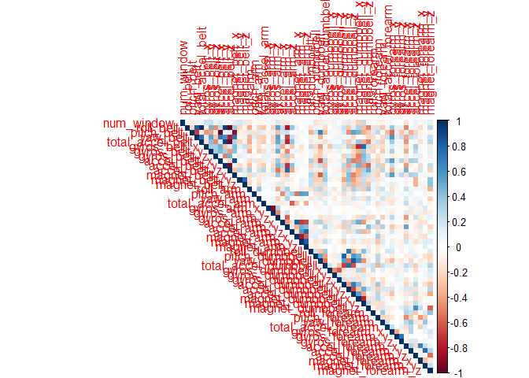

##Setup & Loading Required Packages


```r
setwd("C:/Users/acer/Desktop/R Stuff")
library(caret)
```

```
## Warning: package 'caret' was built under R version 3.5.1
```

```
## Loading required package: lattice
```

```
## Loading required package: ggplot2
```

```r
library(rattle)
```

```
## Warning: package 'rattle' was built under R version 3.5.1
```

```
## Rattle: A free graphical interface for data science with R.
## Version 5.1.0 Copyright (c) 2006-2017 Togaware Pty Ltd.
## Type 'rattle()' to shake, rattle, and roll your data.
```

```r
library(corrplot)
```

```
## Warning: package 'corrplot' was built under R version 3.5.1
```

```
## corrplot 0.84 loaded
```

##Summary

Using devices such as Jawbone Up, Nike FuelBand, and Fitbit it is now possible to collect a large amount of data about personal activity relatively inexpensively. These type of devices are part of the quantified self movement - a group of enthusiasts who take measurements about themselves regularly to improve their health, to find patterns in their behavior, or because they are tech geeks. One thing that people regularly do is quantify how much of a particular activity they do, but they rarely quantify how well they do it. In this project, my goal will be to use data from accelerometers on the belt, forearm, arm, and dumbell of 6 participants. They were asked to perform barbell lifts correctly and incorrectly in 5 different ways.

##Synopsis

The goal of this project is to predict the manner in which they did the exercise. This is the "classe" variable in the training set. I can use any of the other variables to predict with, use cross validation,find the expected out of sample error and use my prediction model to predict 20 different test cases.

###Exploratory Analysis

Downloading and loading data in R.

```r
download.file("https://d396qusza40orc.cloudfront.net/predmachlearn/pml-training.csv","training.csv")
download.file("https://d396qusza40orc.cloudfront.net/predmachlearn/pml-testing.csv","testing.csv")
training<-read.csv("training.csv")
testing<-read.csv("testing.csv")
dim(training)
```

```
## [1] 19622   160
```
We see our data has 160 variables including the outcome variable classe and a total of 19622 observations.


```r
str(training$classe)
```

```
##  Factor w/ 5 levels "A","B","C","D",..: 1 1 1 1 1 1 1 1 1 1 ...
```
So we see there are 5 different Classes namely A,B,C,D, and E.

##Cleaning Data

First we partition our data into 2 sets ,one for training our model and the other for cross validating it.


```r
set.seed(999)
inTrain<-createDataPartition(training$classe,p=0.70,list=FALSE)
train<-training[inTrain,]
test<-training[-inTrain,]
```

Since our data is still huge,we start by removing Near Zero Variables from both train and test.


```r
ZeroVar<-nearZeroVar(train,saveMetrics = TRUE)
train<-train[,ZeroVar$nzv==FALSE]
test<-test[,ZeroVar$nzv==FALSE]
str(train)
```

```
## 'data.frame':	13737 obs. of  106 variables:
##  $ X                       : int  1 3 4 5 6 8 9 10 12 13 ...
##  $ user_name               : Factor w/ 6 levels "adelmo","carlitos",..: 2 2 2 2 2 2 2 2 2 2 ...
##  $ raw_timestamp_part_1    : int  1323084231 1323084231 1323084232 1323084232 1323084232 1323084232 1323084232 1323084232 1323084232 1323084232 ...
##  $ raw_timestamp_part_2    : int  788290 820366 120339 196328 304277 440390 484323 484434 528316 560359 ...
##  $ cvtd_timestamp          : Factor w/ 20 levels "02/12/2011 13:32",..: 9 9 9 9 9 9 9 9 9 9 ...
##  $ num_window              : int  11 11 12 12 12 12 12 12 12 12 ...
##  $ roll_belt               : num  1.41 1.42 1.48 1.48 1.45 1.42 1.43 1.45 1.43 1.42 ...
##  $ pitch_belt              : num  8.07 8.07 8.05 8.07 8.06 8.13 8.16 8.17 8.18 8.2 ...
##  $ yaw_belt                : num  -94.4 -94.4 -94.4 -94.4 -94.4 -94.4 -94.4 -94.4 -94.4 -94.4 ...
##  $ total_accel_belt        : int  3 3 3 3 3 3 3 3 3 3 ...
##  $ max_roll_belt           : num  NA NA NA NA NA NA NA NA NA NA ...
##  $ max_picth_belt          : int  NA NA NA NA NA NA NA NA NA NA ...
##  $ min_roll_belt           : num  NA NA NA NA NA NA NA NA NA NA ...
##  $ min_pitch_belt          : int  NA NA NA NA NA NA NA NA NA NA ...
##  $ amplitude_roll_belt     : num  NA NA NA NA NA NA NA NA NA NA ...
##  $ amplitude_pitch_belt    : int  NA NA NA NA NA NA NA NA NA NA ...
##  $ var_total_accel_belt    : num  NA NA NA NA NA NA NA NA NA NA ...
##  $ avg_roll_belt           : num  NA NA NA NA NA NA NA NA NA NA ...
##  $ stddev_roll_belt        : num  NA NA NA NA NA NA NA NA NA NA ...
##  $ var_roll_belt           : num  NA NA NA NA NA NA NA NA NA NA ...
##  $ avg_pitch_belt          : num  NA NA NA NA NA NA NA NA NA NA ...
##  $ stddev_pitch_belt       : num  NA NA NA NA NA NA NA NA NA NA ...
##  $ var_pitch_belt          : num  NA NA NA NA NA NA NA NA NA NA ...
##  $ avg_yaw_belt            : num  NA NA NA NA NA NA NA NA NA NA ...
##  $ stddev_yaw_belt         : num  NA NA NA NA NA NA NA NA NA NA ...
##  $ var_yaw_belt            : num  NA NA NA NA NA NA NA NA NA NA ...
##  $ gyros_belt_x            : num  0 0 0.02 0.02 0.02 0.02 0.02 0.03 0.02 0.02 ...
##  $ gyros_belt_y            : num  0 0 0 0.02 0 0 0 0 0 0 ...
##  $ gyros_belt_z            : num  -0.02 -0.02 -0.03 -0.02 -0.02 -0.02 -0.02 0 -0.02 0 ...
##  $ accel_belt_x            : int  -21 -20 -22 -21 -21 -22 -20 -21 -22 -22 ...
##  $ accel_belt_y            : int  4 5 3 2 4 4 2 4 2 4 ...
##  $ accel_belt_z            : int  22 23 21 24 21 21 24 22 23 21 ...
##  $ magnet_belt_x           : int  -3 -2 -6 -6 0 -2 1 -3 -2 -3 ...
##  $ magnet_belt_y           : int  599 600 604 600 603 603 602 609 602 606 ...
##  $ magnet_belt_z           : int  -313 -305 -310 -302 -312 -313 -312 -308 -319 -309 ...
##  $ roll_arm                : num  -128 -128 -128 -128 -128 -128 -128 -128 -128 -128 ...
##  $ pitch_arm               : num  22.5 22.5 22.1 22.1 22 21.8 21.7 21.6 21.5 21.4 ...
##  $ yaw_arm                 : num  -161 -161 -161 -161 -161 -161 -161 -161 -161 -161 ...
##  $ total_accel_arm         : int  34 34 34 34 34 34 34 34 34 34 ...
##  $ var_accel_arm           : num  NA NA NA NA NA NA NA NA NA NA ...
##  $ gyros_arm_x             : num  0 0.02 0.02 0 0.02 0.02 0.02 0.02 0.02 0.02 ...
##  $ gyros_arm_y             : num  0 -0.02 -0.03 -0.03 -0.03 -0.02 -0.03 -0.03 -0.03 -0.02 ...
##  $ gyros_arm_z             : num  -0.02 -0.02 0.02 0 0 0 -0.02 -0.02 0 -0.02 ...
##  $ accel_arm_x             : int  -288 -289 -289 -289 -289 -289 -288 -288 -288 -287 ...
##  $ accel_arm_y             : int  109 110 111 111 111 111 109 110 111 111 ...
##  $ accel_arm_z             : int  -123 -126 -123 -123 -122 -124 -122 -124 -123 -124 ...
##  $ magnet_arm_x            : int  -368 -368 -372 -374 -369 -372 -369 -376 -363 -372 ...
##  $ magnet_arm_y            : int  337 344 344 337 342 338 341 334 343 338 ...
##  $ magnet_arm_z            : int  516 513 512 506 513 510 518 516 520 509 ...
##  $ max_picth_arm           : num  NA NA NA NA NA NA NA NA NA NA ...
##  $ max_yaw_arm             : int  NA NA NA NA NA NA NA NA NA NA ...
##  $ min_roll_arm            : num  NA NA NA NA NA NA NA NA NA NA ...
##  $ min_pitch_arm           : num  NA NA NA NA NA NA NA NA NA NA ...
##  $ min_yaw_arm             : int  NA NA NA NA NA NA NA NA NA NA ...
##  $ amplitude_pitch_arm     : num  NA NA NA NA NA NA NA NA NA NA ...
##  $ amplitude_yaw_arm       : int  NA NA NA NA NA NA NA NA NA NA ...
##  $ roll_dumbbell           : num  13.1 12.9 13.4 13.4 13.4 ...
##  $ pitch_dumbbell          : num  -70.5 -70.3 -70.4 -70.4 -70.8 ...
##  $ yaw_dumbbell            : num  -84.9 -85.1 -84.9 -84.9 -84.5 ...
##  $ max_roll_dumbbell       : num  NA NA NA NA NA NA NA NA NA NA ...
##  $ max_picth_dumbbell      : num  NA NA NA NA NA NA NA NA NA NA ...
##  $ min_roll_dumbbell       : num  NA NA NA NA NA NA NA NA NA NA ...
##  $ min_pitch_dumbbell      : num  NA NA NA NA NA NA NA NA NA NA ...
##  $ amplitude_roll_dumbbell : num  NA NA NA NA NA NA NA NA NA NA ...
##  $ amplitude_pitch_dumbbell: num  NA NA NA NA NA NA NA NA NA NA ...
##  $ total_accel_dumbbell    : int  37 37 37 37 37 37 37 37 37 37 ...
##  $ var_accel_dumbbell      : num  NA NA NA NA NA NA NA NA NA NA ...
##  $ avg_roll_dumbbell       : num  NA NA NA NA NA NA NA NA NA NA ...
##  $ stddev_roll_dumbbell    : num  NA NA NA NA NA NA NA NA NA NA ...
##  $ var_roll_dumbbell       : num  NA NA NA NA NA NA NA NA NA NA ...
##  $ avg_pitch_dumbbell      : num  NA NA NA NA NA NA NA NA NA NA ...
##  $ stddev_pitch_dumbbell   : num  NA NA NA NA NA NA NA NA NA NA ...
##  $ var_pitch_dumbbell      : num  NA NA NA NA NA NA NA NA NA NA ...
##  $ avg_yaw_dumbbell        : num  NA NA NA NA NA NA NA NA NA NA ...
##  $ stddev_yaw_dumbbell     : num  NA NA NA NA NA NA NA NA NA NA ...
##  $ var_yaw_dumbbell        : num  NA NA NA NA NA NA NA NA NA NA ...
##  $ gyros_dumbbell_x        : num  0 0 0 0 0 0 0 0 0 0 ...
##  $ gyros_dumbbell_y        : num  -0.02 -0.02 -0.02 -0.02 -0.02 -0.02 -0.02 -0.02 -0.02 -0.02 ...
##  $ gyros_dumbbell_z        : num  0 0 -0.02 0 0 0 0 0 0 -0.02 ...
##  $ accel_dumbbell_x        : int  -234 -232 -232 -233 -234 -234 -232 -235 -233 -234 ...
##  $ accel_dumbbell_y        : int  47 46 48 48 48 46 47 48 47 48 ...
##  $ accel_dumbbell_z        : int  -271 -270 -269 -270 -269 -272 -269 -270 -270 -269 ...
##  $ magnet_dumbbell_x       : int  -559 -561 -552 -554 -558 -555 -549 -558 -554 -552 ...
##  $ magnet_dumbbell_y       : int  293 298 303 292 294 300 292 291 291 302 ...
##  $ magnet_dumbbell_z       : num  -65 -63 -60 -68 -66 -74 -65 -69 -65 -69 ...
##  $ roll_forearm            : num  28.4 28.3 28.1 28 27.9 27.8 27.7 27.7 27.5 27.2 ...
##  $ pitch_forearm           : num  -63.9 -63.9 -63.9 -63.9 -63.9 -63.8 -63.8 -63.8 -63.8 -63.9 ...
##  $ yaw_forearm             : num  -153 -152 -152 -152 -152 -152 -152 -152 -152 -151 ...
##  $ max_roll_forearm        : num  NA NA NA NA NA NA NA NA NA NA ...
##  $ max_picth_forearm       : num  NA NA NA NA NA NA NA NA NA NA ...
##  $ min_roll_forearm        : num  NA NA NA NA NA NA NA NA NA NA ...
##  $ min_pitch_forearm       : num  NA NA NA NA NA NA NA NA NA NA ...
##  $ amplitude_roll_forearm  : num  NA NA NA NA NA NA NA NA NA NA ...
##  $ amplitude_pitch_forearm : num  NA NA NA NA NA NA NA NA NA NA ...
##  $ total_accel_forearm     : int  36 36 36 36 36 36 36 36 36 36 ...
##  $ var_accel_forearm       : num  NA NA NA NA NA NA NA NA NA NA ...
##  $ gyros_forearm_x         : num  0.03 0.03 0.02 0.02 0.02 0.02 0.03 0.02 0.02 0 ...
##  $ gyros_forearm_y         : num  0 -0.02 -0.02 0 -0.02 -0.02 0 0 0.02 0 ...
##  $ gyros_forearm_z         : num  -0.02 0 0 -0.02 -0.03 0 -0.02 -0.02 -0.03 -0.03 ...
##   [list output truncated]
```

Next,we remove indicator variables.


```r
train<-train[,-(1:5)]
test<-test[,-(1:5)]
str(train)
```

```
## 'data.frame':	13737 obs. of  101 variables:
##  $ num_window              : int  11 11 12 12 12 12 12 12 12 12 ...
##  $ roll_belt               : num  1.41 1.42 1.48 1.48 1.45 1.42 1.43 1.45 1.43 1.42 ...
##  $ pitch_belt              : num  8.07 8.07 8.05 8.07 8.06 8.13 8.16 8.17 8.18 8.2 ...
##  $ yaw_belt                : num  -94.4 -94.4 -94.4 -94.4 -94.4 -94.4 -94.4 -94.4 -94.4 -94.4 ...
##  $ total_accel_belt        : int  3 3 3 3 3 3 3 3 3 3 ...
##  $ max_roll_belt           : num  NA NA NA NA NA NA NA NA NA NA ...
##  $ max_picth_belt          : int  NA NA NA NA NA NA NA NA NA NA ...
##  $ min_roll_belt           : num  NA NA NA NA NA NA NA NA NA NA ...
##  $ min_pitch_belt          : int  NA NA NA NA NA NA NA NA NA NA ...
##  $ amplitude_roll_belt     : num  NA NA NA NA NA NA NA NA NA NA ...
##  $ amplitude_pitch_belt    : int  NA NA NA NA NA NA NA NA NA NA ...
##  $ var_total_accel_belt    : num  NA NA NA NA NA NA NA NA NA NA ...
##  $ avg_roll_belt           : num  NA NA NA NA NA NA NA NA NA NA ...
##  $ stddev_roll_belt        : num  NA NA NA NA NA NA NA NA NA NA ...
##  $ var_roll_belt           : num  NA NA NA NA NA NA NA NA NA NA ...
##  $ avg_pitch_belt          : num  NA NA NA NA NA NA NA NA NA NA ...
##  $ stddev_pitch_belt       : num  NA NA NA NA NA NA NA NA NA NA ...
##  $ var_pitch_belt          : num  NA NA NA NA NA NA NA NA NA NA ...
##  $ avg_yaw_belt            : num  NA NA NA NA NA NA NA NA NA NA ...
##  $ stddev_yaw_belt         : num  NA NA NA NA NA NA NA NA NA NA ...
##  $ var_yaw_belt            : num  NA NA NA NA NA NA NA NA NA NA ...
##  $ gyros_belt_x            : num  0 0 0.02 0.02 0.02 0.02 0.02 0.03 0.02 0.02 ...
##  $ gyros_belt_y            : num  0 0 0 0.02 0 0 0 0 0 0 ...
##  $ gyros_belt_z            : num  -0.02 -0.02 -0.03 -0.02 -0.02 -0.02 -0.02 0 -0.02 0 ...
##  $ accel_belt_x            : int  -21 -20 -22 -21 -21 -22 -20 -21 -22 -22 ...
##  $ accel_belt_y            : int  4 5 3 2 4 4 2 4 2 4 ...
##  $ accel_belt_z            : int  22 23 21 24 21 21 24 22 23 21 ...
##  $ magnet_belt_x           : int  -3 -2 -6 -6 0 -2 1 -3 -2 -3 ...
##  $ magnet_belt_y           : int  599 600 604 600 603 603 602 609 602 606 ...
##  $ magnet_belt_z           : int  -313 -305 -310 -302 -312 -313 -312 -308 -319 -309 ...
##  $ roll_arm                : num  -128 -128 -128 -128 -128 -128 -128 -128 -128 -128 ...
##  $ pitch_arm               : num  22.5 22.5 22.1 22.1 22 21.8 21.7 21.6 21.5 21.4 ...
##  $ yaw_arm                 : num  -161 -161 -161 -161 -161 -161 -161 -161 -161 -161 ...
##  $ total_accel_arm         : int  34 34 34 34 34 34 34 34 34 34 ...
##  $ var_accel_arm           : num  NA NA NA NA NA NA NA NA NA NA ...
##  $ gyros_arm_x             : num  0 0.02 0.02 0 0.02 0.02 0.02 0.02 0.02 0.02 ...
##  $ gyros_arm_y             : num  0 -0.02 -0.03 -0.03 -0.03 -0.02 -0.03 -0.03 -0.03 -0.02 ...
##  $ gyros_arm_z             : num  -0.02 -0.02 0.02 0 0 0 -0.02 -0.02 0 -0.02 ...
##  $ accel_arm_x             : int  -288 -289 -289 -289 -289 -289 -288 -288 -288 -287 ...
##  $ accel_arm_y             : int  109 110 111 111 111 111 109 110 111 111 ...
##  $ accel_arm_z             : int  -123 -126 -123 -123 -122 -124 -122 -124 -123 -124 ...
##  $ magnet_arm_x            : int  -368 -368 -372 -374 -369 -372 -369 -376 -363 -372 ...
##  $ magnet_arm_y            : int  337 344 344 337 342 338 341 334 343 338 ...
##  $ magnet_arm_z            : int  516 513 512 506 513 510 518 516 520 509 ...
##  $ max_picth_arm           : num  NA NA NA NA NA NA NA NA NA NA ...
##  $ max_yaw_arm             : int  NA NA NA NA NA NA NA NA NA NA ...
##  $ min_roll_arm            : num  NA NA NA NA NA NA NA NA NA NA ...
##  $ min_pitch_arm           : num  NA NA NA NA NA NA NA NA NA NA ...
##  $ min_yaw_arm             : int  NA NA NA NA NA NA NA NA NA NA ...
##  $ amplitude_pitch_arm     : num  NA NA NA NA NA NA NA NA NA NA ...
##  $ amplitude_yaw_arm       : int  NA NA NA NA NA NA NA NA NA NA ...
##  $ roll_dumbbell           : num  13.1 12.9 13.4 13.4 13.4 ...
##  $ pitch_dumbbell          : num  -70.5 -70.3 -70.4 -70.4 -70.8 ...
##  $ yaw_dumbbell            : num  -84.9 -85.1 -84.9 -84.9 -84.5 ...
##  $ max_roll_dumbbell       : num  NA NA NA NA NA NA NA NA NA NA ...
##  $ max_picth_dumbbell      : num  NA NA NA NA NA NA NA NA NA NA ...
##  $ min_roll_dumbbell       : num  NA NA NA NA NA NA NA NA NA NA ...
##  $ min_pitch_dumbbell      : num  NA NA NA NA NA NA NA NA NA NA ...
##  $ amplitude_roll_dumbbell : num  NA NA NA NA NA NA NA NA NA NA ...
##  $ amplitude_pitch_dumbbell: num  NA NA NA NA NA NA NA NA NA NA ...
##  $ total_accel_dumbbell    : int  37 37 37 37 37 37 37 37 37 37 ...
##  $ var_accel_dumbbell      : num  NA NA NA NA NA NA NA NA NA NA ...
##  $ avg_roll_dumbbell       : num  NA NA NA NA NA NA NA NA NA NA ...
##  $ stddev_roll_dumbbell    : num  NA NA NA NA NA NA NA NA NA NA ...
##  $ var_roll_dumbbell       : num  NA NA NA NA NA NA NA NA NA NA ...
##  $ avg_pitch_dumbbell      : num  NA NA NA NA NA NA NA NA NA NA ...
##  $ stddev_pitch_dumbbell   : num  NA NA NA NA NA NA NA NA NA NA ...
##  $ var_pitch_dumbbell      : num  NA NA NA NA NA NA NA NA NA NA ...
##  $ avg_yaw_dumbbell        : num  NA NA NA NA NA NA NA NA NA NA ...
##  $ stddev_yaw_dumbbell     : num  NA NA NA NA NA NA NA NA NA NA ...
##  $ var_yaw_dumbbell        : num  NA NA NA NA NA NA NA NA NA NA ...
##  $ gyros_dumbbell_x        : num  0 0 0 0 0 0 0 0 0 0 ...
##  $ gyros_dumbbell_y        : num  -0.02 -0.02 -0.02 -0.02 -0.02 -0.02 -0.02 -0.02 -0.02 -0.02 ...
##  $ gyros_dumbbell_z        : num  0 0 -0.02 0 0 0 0 0 0 -0.02 ...
##  $ accel_dumbbell_x        : int  -234 -232 -232 -233 -234 -234 -232 -235 -233 -234 ...
##  $ accel_dumbbell_y        : int  47 46 48 48 48 46 47 48 47 48 ...
##  $ accel_dumbbell_z        : int  -271 -270 -269 -270 -269 -272 -269 -270 -270 -269 ...
##  $ magnet_dumbbell_x       : int  -559 -561 -552 -554 -558 -555 -549 -558 -554 -552 ...
##  $ magnet_dumbbell_y       : int  293 298 303 292 294 300 292 291 291 302 ...
##  $ magnet_dumbbell_z       : num  -65 -63 -60 -68 -66 -74 -65 -69 -65 -69 ...
##  $ roll_forearm            : num  28.4 28.3 28.1 28 27.9 27.8 27.7 27.7 27.5 27.2 ...
##  $ pitch_forearm           : num  -63.9 -63.9 -63.9 -63.9 -63.9 -63.8 -63.8 -63.8 -63.8 -63.9 ...
##  $ yaw_forearm             : num  -153 -152 -152 -152 -152 -152 -152 -152 -152 -151 ...
##  $ max_roll_forearm        : num  NA NA NA NA NA NA NA NA NA NA ...
##  $ max_picth_forearm       : num  NA NA NA NA NA NA NA NA NA NA ...
##  $ min_roll_forearm        : num  NA NA NA NA NA NA NA NA NA NA ...
##  $ min_pitch_forearm       : num  NA NA NA NA NA NA NA NA NA NA ...
##  $ amplitude_roll_forearm  : num  NA NA NA NA NA NA NA NA NA NA ...
##  $ amplitude_pitch_forearm : num  NA NA NA NA NA NA NA NA NA NA ...
##  $ total_accel_forearm     : int  36 36 36 36 36 36 36 36 36 36 ...
##  $ var_accel_forearm       : num  NA NA NA NA NA NA NA NA NA NA ...
##  $ gyros_forearm_x         : num  0.03 0.03 0.02 0.02 0.02 0.02 0.03 0.02 0.02 0 ...
##  $ gyros_forearm_y         : num  0 -0.02 -0.02 0 -0.02 -0.02 0 0 0.02 0 ...
##  $ gyros_forearm_z         : num  -0.02 0 0 -0.02 -0.03 0 -0.02 -0.02 -0.03 -0.03 ...
##  $ accel_forearm_x         : int  192 196 189 189 193 193 193 190 191 193 ...
##  $ accel_forearm_y         : int  203 204 206 206 203 205 204 205 203 205 ...
##  $ accel_forearm_z         : int  -215 -213 -214 -214 -215 -213 -214 -215 -215 -215 ...
##  $ magnet_forearm_x        : int  -17 -18 -16 -17 -9 -9 -16 -22 -11 -15 ...
##  $ magnet_forearm_y        : num  654 658 658 655 660 660 653 656 657 655 ...
##   [list output truncated]
```

We notice that a lot of variables are constituted mostly of missing values.Hence we remove those variables from both train and test sets.


```r
MaxNAs<-sapply(train,function(x)mean(is.na(x)))>0.95
train<-train[,MaxNAs==FALSE]
test<-test[,MaxNAs==FALSE]
dim(train)
```

```
## [1] 13737    54
```

```r
dim(test)
```

```
## [1] 5885   54
```

```r
mean(is.na(train))
```

```
## [1] 0
```

```r
mean(is.na(test))
```

```
## [1] 0
```

##Correlation

We Plot a correlation matrix to check whether variables are highly correlated with each other.

```r
Cor<-cor(train[,-54])
corrplot(Cor,"color",type="upper")
```

<!-- -->
We move on with fitting every variable as a predictor.

##Fitting Models

Now we use different methods to fit a regression model and train it for better accuracy.

###R-Part Method


```r
set.seed(999)
fit_rpart<-train(classe~.,method="rpart",data=train)
fancyRpartPlot(fit_rpart$finalModel)
```

<!-- -->

```r
pred_rpart<-predict(fit_rpart,test)
confusionMatrix(pred_rpart,test$classe)
```

```
## Confusion Matrix and Statistics
## 
##           Reference
## Prediction    A    B    C    D    E
##          A 1527  473  495  441  163
##          B   23  376   31  171  132
##          C  120  290  500  352  263
##          D    0    0    0    0    0
##          E    4    0    0    0  524
## 
## Overall Statistics
##                                           
##                Accuracy : 0.4974          
##                  95% CI : (0.4845, 0.5102)
##     No Information Rate : 0.2845          
##     P-Value [Acc > NIR] : < 2.2e-16       
##                                           
##                   Kappa : 0.3425          
##  Mcnemar's Test P-Value : NA              
## 
## Statistics by Class:
## 
##                      Class: A Class: B Class: C Class: D Class: E
## Sensitivity            0.9122  0.33011  0.48733   0.0000  0.48429
## Specificity            0.6267  0.92478  0.78905   1.0000  0.99917
## Pos Pred Value         0.4927  0.51296  0.32787      NaN  0.99242
## Neg Pred Value         0.9472  0.85190  0.87936   0.8362  0.89584
## Prevalence             0.2845  0.19354  0.17434   0.1638  0.18386
## Detection Rate         0.2595  0.06389  0.08496   0.0000  0.08904
## Detection Prevalence   0.5266  0.12455  0.25913   0.0000  0.08972
## Balanced Accuracy      0.7694  0.62745  0.63819   0.5000  0.74173
```
Using R-part, we see that this model predicts with an accuracy of 52% and has an out of sample error of 47.8% .This is not a good prediction model.

###Random Forests Method


```r
set.seed(999)
fit_rf<-train(classe~.,method="rf",data=train,trControl=trainControl(method="cv",number=3,verboseIter=FALSE))
pred_rf<-predict(fit_rf,test)
confusionMatrix(pred_rf,test$classe)
```

```
## Confusion Matrix and Statistics
## 
##           Reference
## Prediction    A    B    C    D    E
##          A 1673    2    0    0    0
##          B    0 1135    0    0    0
##          C    0    2 1026    7    0
##          D    0    0    0  956    0
##          E    1    0    0    1 1082
## 
## Overall Statistics
##                                           
##                Accuracy : 0.9978          
##                  95% CI : (0.9962, 0.9988)
##     No Information Rate : 0.2845          
##     P-Value [Acc > NIR] : < 2.2e-16       
##                                           
##                   Kappa : 0.9972          
##  Mcnemar's Test P-Value : NA              
## 
## Statistics by Class:
## 
##                      Class: A Class: B Class: C Class: D Class: E
## Sensitivity            0.9994   0.9965   1.0000   0.9917   1.0000
## Specificity            0.9995   1.0000   0.9981   1.0000   0.9996
## Pos Pred Value         0.9988   1.0000   0.9913   1.0000   0.9982
## Neg Pred Value         0.9998   0.9992   1.0000   0.9984   1.0000
## Prevalence             0.2845   0.1935   0.1743   0.1638   0.1839
## Detection Rate         0.2843   0.1929   0.1743   0.1624   0.1839
## Detection Prevalence   0.2846   0.1929   0.1759   0.1624   0.1842
## Balanced Accuracy      0.9995   0.9982   0.9991   0.9959   0.9998
```
Using Random forests method, we see that this model predicts with an accuracy of 99.7% and has an out of sample error of 0.3%.This is a good prediction model,and we'll call it our best fit model.

##Predicting on Test Set

Now we use our best fit model to predict values using testing set as newdata.


```r
set.seed(999)
predict(fit_rf,newdata=testing)
```

```
##  [1] B A B A A E D B A A B C B A E E A B B B
## Levels: A B C D E
```
